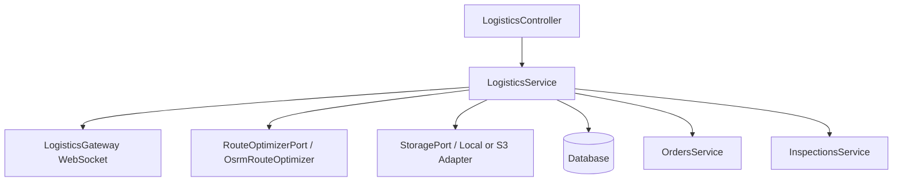

# Logistics & Transport Module

The Logistics & Transport module orchestrates the physical movement of agricultural goods from individual farm collection points (collection stops) to buyer delivery addresses (delivery stops). It manages driver assignments, tracks vehicles, plans optimised multi-stop runs using OSRM, enforces AI-based quality Prescreen reports during pickups, and integrates stop completions back into order line deliveries.

---

## Technical Architecture



### Key Ports and Interfaces

1. **`RouteOptimizerPort`**: Decouples the routing logic. The default implementation `OsrmRouteOptimizer` leverages OSRM's public trip endpoint (`/trip/v1/driving`) to calculate the optimal stop sequence and travel metadata.
2. **`StoragePort`**: Manages proof photo uploads. Employs `S3StorageAdapter` in production and automatically falls back to `LocalStorageAdapter` for local development when no credentials/bucket are configured.

---

## Database Schemas

### `vehicles`
Represents the fleet registry.
- `id` (uuid, PK)
- `registration_plate` (varchar, unique)
- `type` (`TRUCK`, `VAN`, `MOTORCYCLE`, `UTILITY`)
- `capacity_kg` (decimal) - Max load weight
- `capacity_m3` (decimal) - Max volume capacity
- `is_active` (boolean, default true)
- `current_driver_id` (uuid, FK → users, nullable)
- `last_known_lat` / `last_known_lon` (decimal, nullable)
- `last_seen_at` (timestamptz, nullable)

### `delivery_runs`
Represents a scheduled delivery run.
- `id` (uuid, PK)
- `driver_id` (uuid, FK → users, nullable)
- `vehicle_id` (uuid, FK → vehicles, nullable)
- `status` (`PLANNED`, `IN_PROGRESS`, `COMPLETED`, `CANCELLED`)
- `scheduled_at` (timestamptz)
- `started_at` / `completed_at` (timestamptz, nullable)
- `optimised_route` (jsonb, nullable) - Ordered stop sequence cached from OSRM
- `total_distance_km` (decimal, nullable)

### `delivery_stops`
Represents an individual stop (collection or delivery) along a run.
- `id` (uuid, PK)
- `run_id` (uuid, FK → delivery_runs)
- `order_line_id` (uuid, FK → order_lines)
- `type` (`COLLECTION`, `DELIVERY`)
- `sequence` (integer) - Order of visit (0-indexed)
- `status` (`PENDING`, `ARRIVED`, `COMPLETED`, `SKIPPED`)
- `address` (jsonb) - `{ street, city, lat, lon }`
- `eta` (timestamptz, nullable)
- `arrived_at` / `completed_at` (timestamptz, nullable)
- `proof_photo_url` (varchar, nullable)
- `pickup_report_id` (uuid, FK → inspection_reports, nullable)

### `driver_locations`
Append-only log of driver GPS positions.
- `id` (uuid, PK)
- `driver_id` (uuid, FK → users)
- `run_id` (uuid, FK → delivery_runs, nullable)
- `lat` / `lon` (decimal)
- `heading` (decimal, nullable) - Direction in degrees (0-360)
- `speed_kmh` (decimal, nullable)
- `recorded_at` (timestamptz)

---

## State Machines

### Delivery Run Lifecycle
```
  [PLANNED] ---> [IN_PROGRESS] ---> [COMPLETED]
      |
      +--------> [CANCELLED]
```

### Delivery Stop Lifecycle
```
  [PENDING] ---> [ARRIVED] ---> [COMPLETED]
                     |
                     +--------> [SKIPPED]
```

---

## Integration Gating

- **AI Pickup Quality Check**: When a driver is at a `COLLECTION` stop, they must perform an AI quality inspection using the image classification service before they can mark the stop as `COMPLETED`. The resulting report ID is saved as `pickup_report_id`.
- **Order Line Delivery Propagation**: When a `DELIVERY` stop is marked `COMPLETED`, the corresponding `OrderLineEntity` status in the `orders` module is automatically updated to `DELIVERED`.

---

## REST API Surface

### Fleet Management
- `POST /v1/logistics/vehicles` - Register a vehicle
- `GET /v1/logistics/vehicles` - List fleet
- `PATCH /v1/logistics/vehicles/:id` - Update vehicle metadata
- `DELETE /v1/logistics/vehicles/:id` - Deactivate vehicle
- `POST /v1/logistics/vehicles/:id/assign-driver` - Bind driver to vehicle

### Run & Route Planning
- `POST /v1/logistics/runs` - Create run (triggers OSRM sequence optimization)
- `GET /v1/logistics/runs` - Admin: view all runs
- `GET /v1/logistics/runs/my` - Driver: view assigned runs
- `POST /v1/logistics/runs/:id/start` - Driver: start run
- `POST /v1/logistics/runs/:id/cancel` - Admin: cancel run

### Stop Lifecycle
- `POST /v1/logistics/runs/:id/stops/:stopId/arrive` - Arrive at stop
- `POST /v1/logistics/runs/:id/stops/:stopId/pickup-report` - Link pickup inspection report (COLLECTION only)
- `POST /v1/logistics/runs/:id/stops/:stopId/proof` - Upload proof photo (mutipart/form-data)
- `POST /v1/logistics/runs/:id/stops/:stopId/complete` - Complete stop
- `POST /v1/logistics/runs/:id/stops/:stopId/skip` - Skip stop with reason

---

## Real-Time Gateway (WebSockets)

Runs on the `/logistics` namespace.

### Client-to-Server Events
- `join_run` `{ runId: string }` - Subscribe to run room
- `leave_run` `{ runId: string }` - Unsubscribe from run room
- `driver:location:push` `PushLocationDto` - Push GPS coordinates

### Server-to-Client Events
- `driver:location:update` `{ driverId, lat, lon, heading }` - Driver position update
- `stop:status:update` `{ stopId, status, completedAt }` - Stop status update
- `run:status:update` `{ runId, status }` - Overall run status update
